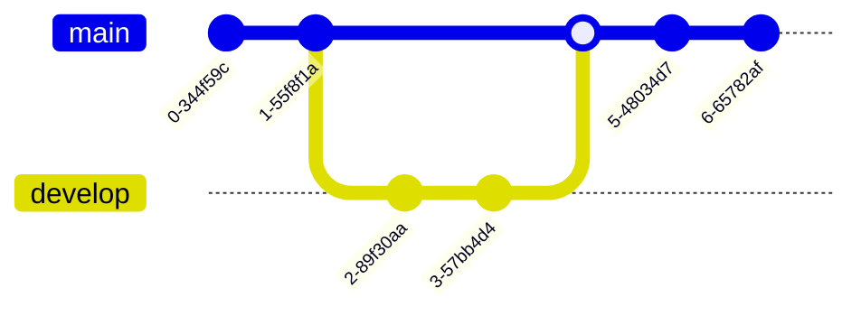

# RepositorioPrueba

Primer repositorio de prueba en Platzi

Mi primera contribucion local para GitHub

Un commit mas desde GitHub

Una actualizacion mas, de nuevo desde GitHub

Cambios desde mi rama local: developer01

